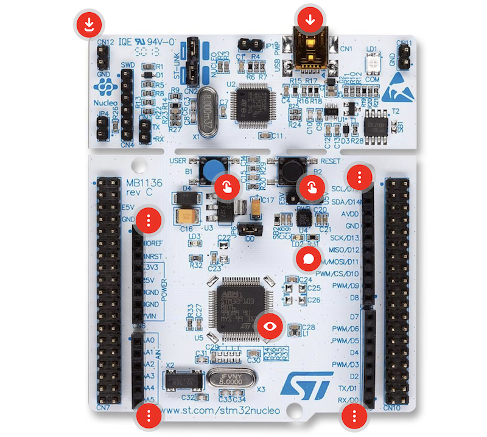

# Hello, World!

</br>

No one starts learning a new programming language (or in this case, a new _target_) without beginning with a **"Hello, World!"**. Usually, "Hello, World" programs are small applications that run on the _host_ or Personal Computer (PC) and display the phrase "Hello, World" on the screen. In our case, we don't have a screen! The equivalent in microcontrollers is making an LED blink. We will take it a step further by making the [LED](https://en.wikipedia.org/wiki/Light-emitting_diode) turn on at our command using the button or _push button_ on the Evaluation Board ([EVB](https://en.wikipedia.org/wiki/Microprocessor_development_board)).

In this exercise, we will learn to create a program with Arduino. In this program, we will use the fundamental pillar of microcontrollers: digital GPIOs. The use of digital GPIOs is present in countless devices and applications, ranging from detecting button presses and generating indicators in user interfaces to detecting or generating events in a biomedical device, such as detecting the presence of a sensor strip in a glucometer or monitoring the power status of a battery-powered _Point-of-Care_ (PoC) device, among many other uses.

## Objectives

- Get to know the STM32 Nucleo-F401RE EVB.
- Learn about Arduino IDE and how it works.
- Create, compile, and upload the first program in Arduino.
- Use GPIOs both as inputs and outputs.
- First introduction to VCS (Git).

## Procedure

### IDE Preparation

#### Installing Arduino IDE

The first step is to install the application used to develop Arduino-based programs: Arduino IDE. The acronym IDE stands for [_Integrated Development Environment_](https://en.wikipedia.org/wiki/Integrated_development_environment). An IDE is an application that provides the necessary tools to develop, compile, deploy, and debug _software_. To install it, we start by downloading the application from the following [link](https://www.arduino.cc/en/software).

> The application is available for multiple Operating Systems (OS). The exercises can be performed on all OSs compatible with the application, but **the details of their development, as well as the guarantee of correct functionality, will be based on Windows**. Specifically, Windows 11.

Installing Arduino IDE is as simple as running the downloaded `.exe` file and following the mathematical algorithm `Next`, `Next`, `Next`, ..., and `Finish`. Detailed instructions on how to click through the different `Next` steps can be found at this [link](https://docs.arduino.cc/software/ide-v2/tutorials/getting-started/ide-v2-downloading-and-installing/).

#### EVB Configuration

Once installed, Arduino IDE can program its own EVBs: [Arduino UNO](https://store.arduino.cc/products/arduino-uno-rev3/), [Arduino Zero](https://store.arduino.cc/products/arduino-zero), [Arduino Due](https://store.arduino.cc/products/arduino-due), among others. However, the EVB we will use is a board from [STMicroelectronics (STM)](https://www.st.com/): the [STM32 Nucleo-F401RE](https://www.st.com/en/evaluation-tools/nucleo-f401re.html). This EVB is compatible with Arduino, but since it is not marketed by the Arduino company, its configuration files need to be imported into the IDE. Fortunately for us, importing the configuration files into Arduino IDE is very easy, and STM provides official configuration files for its EVBs.

The procedure to import the configuration files can be found in one of the repositories of STM's official GitHub account, available at the following [link](https://github.com/stm32duino/Arduino_Core_STM32/wiki/Getting-Started#add-stm32-boards-support-to-arduino).

### The STM32 Nucleo-F401RE EVB

As mentioned earlier, the EVB we will use is the STM32 Nucleo-F401RE from STMicroelectronics. This EVB features the [STM32F401RET6U](https://www.st.com/en/product/STM32F401RE) microcontroller from the same manufacturer.

One of the key advantages of EVBs is that they provide a quick and cost-effective way to prototype microcontroller-based devices. For example, the STM32 Nucleo-F401RE has a current retail price of around €15 and already includes an integrated _debugger_ (the electronic circuit required to program the microcontroller). A standalone official _debugger_ alone can cost over €100.

Manufacturers create these EVBs to facilitate entry into their development ecosystem at a low cost, ultimately encouraging developers to adopt their microcontrollers. Another advantage is that the EVB exposes all the microcontroller's pins, making it easier to connect external components during the prototyping phase and eliminating the need to design custom prototype boards—saving significant costs in design, components, manufacturing, and testing.

Below is an image of the EVB we will use.

<p align="center">

</p>

The schematic of the EVB can be found [here](https://www.st.com/resource/en/schematic_pack/mb1136-default-c04_schematic.pdf). Three other important documents, which we will not yet use in this Arduino practice, are: the [microcontroller _datasheet_](https://www.st.com/resource/en/datasheet/stm32f401re.pdf), the [reference manual for the microcontroller family](https://www.st.com/resource/en/reference_manual/dm00096844.pdf), and the [user manual for the HAL (_Hardware Abstraction Layer_) libraries](https://www.st.com/resource/en/user_manual/dm00105879.pdf).

### Now, Let's Say: Hello, World!

In these initial la sessions, so that everyone can learn the most basic tasks, you must follow the instructions exactly as given. We will leave interactions with your lab partner’s work and teamwork for future sessions. So for now: everyone must do what is required here!

#### Cloning the Repository

In this and all other course practices, a [Version Control System (VCS)](https://en.wikipedia.org/wiki/Version_control) is used for development, collaboration, and submission of assignments and projects. The details of how VCS works will be gradually introduced in each practice and covered in depth in a dedicated unit. For now, we ask for a small leap of faith—just follow the Git instructions carefully. We will explain the commands and terms as they appear, leaving more detailed explanations for the dedicated unit.

Since this is the first lab session, if you haven't done so already, we will go through the process of cloning the remote [repository](<https://en.wikipedia.org/wiki/Repository_(version_control)>) from GitHub to our computer. This means having a local copy of all the content stored in GitHub and establishing a link to the remote repository. This link will allow us to retrieve versions and branches hosted on the server and push our changes.

To do this, navigate to the main page of the repository `Biomedical-Electronics\masb-p01-<your-group>` and copy the link available in the green `Clone or Download` button. Make sure you copy the link while it says `Clone with HTTPS` and not `Clone with SSH`.

Once the link is copied, go to the folder where you want to store your local repository. Right-click on an empty space (not on any file or folder) and select `Git Bash here` from the dropdown menu. If this option does not appear, it is likely that Git is not installed. You can install it by downloading it from this [link](https://git-scm.com/) and following the previously described algorithm: `Next`, `Next`, `Next`, ..., and `Finish`.

> It is important to keep in mind that **Git and GitHub are different things**. Git is the actual VCS and is _open source_. On the other hand, GitHub is a company that provides a website using Git to store the version history on a remote server, enabling collaboration and sharing (among many other features that we will gradually explore).

When clicking on `Git Bash here`, a _bash_ terminal will open. There, we execute the following command:

```bash
git clone <copied-url>
```

If this is our first `git clone` of a GitHub repository, it will ask for our credentials. We enter them (GitHub email and password). With all of this, the remote repository on GitHub has been cloned to our computer, and we can start working.

> **Important:** When cloning or initializing a repository, a `.git` folder is created, which is typically hidden. **Do not delete this folder**, or the version control in your local repository will be lost, and you will not be able to push your work.

One last step is to enter our name and email in the Git configuration so that they appear when we make _commits_ to our local repository. The name and email can be set for just the current repository or globally for all repositories. We will do the latter. First, we enter the folder that has been created for us:

```bash
cd masb-p01-<your-group>
```

And there, we enter:

```bash
git config --global user.name "<full-name>"
git config --global user.email "<your-email-in-github>"
```

If we removed the `--global` from the command, we would be setting the name and email only for the current repository. (Therefore, do not use `--global` if you are on a shared computer with different repositories).

Here comes the first leap of faith. Run the following command:

```bash
git switch -c lab/A-<full-name-without-spaces-nither-strange-characters>
```

With this command, you create a branch named `lab/A-<full-name-without-spaces-nither-strange-characters>` and switch to it. A branch is a separate line of development in the repository where you can work in parallel without interfering with the main development or with other team members. By the end of the practice, there will be more than one branch: one for each member of your team. From here on, do not close the terminal as we will use it to make various _commits_. (If you close the terminal: _no problem_. Just open it again as before from within the `masb-p01-<your-group>` folder.)

#### Create a _sketch_

Great. We now have our local repository on our computer. Now let's create the file where we will develop our program with Arduino. These files use the `.ino` format and are called _sketches_. To create the file, simply open Arduino IDE and go to `File > New`. Then, select the EVB for which the program will be developed. We do this by going to `Tools > Board` and selecting `Nucleo-64`. This selects the family to which the EVB belongs. Now, we will choose the model of this EVB by going to `Tools > Board part number` and selecting `Nucleo F401RE`. The last thing we need to do is select the method with which we will upload the program to the microcontroller. We do this by going to `Tools > Upload method` and selecting `Mass Storage`. Finally, click on `Save As...` from `File` and save the _sketch_ in `./arduino` with the name `masb-p01`. A folder named `masb-p01` will be created inside the `arduino` folder, and inside it, a `masb-p01.ino` file will be created, which is the Arduino programming file itself. A _sketch_.

> It is **very important** that you save all files in the specified _paths_ or directories using the indicated name.

Now we have the following code in front of us:

```c++
void setup() {
  // put your setup code here, to run once:

}

void loop() {
  // put your main code here, to run repeatedly:

}
```

We have two functions: `setup` and `loop`. Arduino IDE has already added comments indicating the purpose of each function. The `setup` function is executed once at the beginning of the program and is usually used to initialize variables, peripherals, etc. On the other hand, the `loop` function, once `setup` has been executed, will run continuously. This is where the desired behavior for the microcontroller is coded. We are going to create a program that makes the EVB's LED blink every 1 second.

#### Digital Outputs: _Blink the LED_

The LED is connected to pin D13 of the Arduino connector. The `D` denotes that this pin is a digital GPIO that we will use as an output. GPIO stands for _General Purpose Input/Output_ and is a pin on the microcontroller that can perform various functions (e.g., capturing an analog signal, generating a PWM, programming the microcontroller, etc.), both as input (reading) and output (generating a signal). In Arduino, the GPIO function cannot be directly modified, and pin D13 in particular can only be used as a digital GPIO. In this case, we will send a digital signal to the LED to turn it on and off. When the digital output signal is `0`, the LED will be off. When it's `1`, the LED will be on.

> It's important to note that in the digital world, we work with a binary system, meaning ones and zeros. But this is at a logical level. At a physical level, these binary values of `0` and `1` are translated to defined voltage levels. These voltage levels are usually 0 V for a `0` and the supply voltage of the microcontroller for a `1`. In this case, the EVB powers the microcontroller with 3.3 V, so a binary `1` corresponds to a voltage level of 3.3 V.

So, the first thing we need to do is configure pin D13 as a digital output GPIO. Since the functionality/usage of the pin will not change throughout the program, we only need to configure it once. Therefore, the configuration will be done using the `pinMode` instruction within the `setup` function.

```c++
void setup() {
  // put your setup code here, to run once:
  pinMode(13, OUTPUT); // we configure pin 13 as a digital output pin.
  digitalWrite(13, LOW); // we configure the LED to be off when the program starts.
}

void loop() {
  // put your main code here, to run repeatedly:

}
```

It is important (**and mandatory in the course**) to comment the code so that a third person, and sometimes even ourselves, can understand what is happening in the program when reading it. Do not use Ñs, accents, or strange characters in the comments.

In the `pinMode` function, we configured pin 13 as an `OUTPUT` or output pin. If we wanted to set it as input (reading a digital value), we would specify `INPUT`. We also added a second instruction, `digitalWrite`, which tells us what value we want to output through the specified pin. If we indicate `LOW`, we are telling it to output a `0`. If we specify `HIGH`, we are telling it to output a `1`.

> A note for navigators: It is very tempting to copy and paste the code from the document instead of writing it yourself. We warn you in advance that this would be a serious mistake. Not because you can't do it (you can), but because you will not understand or integrate the concepts being studied in the lab sessions, and it will be very difficult for you to tackle the final project on your own.

Now, what we are going to do is make the LED blink. This will happen continuously during the execution of the program, so we will code it in the `loop` function. We have just seen the `digitalWrite` function to set an output value. We can guess that to make the LED blink, we only need to use this function alternating between `LOW` and `HIGH`.

```c++
void setup() {
  // put your setup code here, to run once:
  pinMode(13, OUTPUT); // we configure pin 13 as a digital output pin.
  digitalWrite(13, LOW); // we configure the LED to be off when the program starts.
}

void loop() {
  // put your main code here, to run repeatedly:
  digitalWrite(13, HIGH); // LED on
  digitalWrite(13, LOW); // LED off
}
```

We compile the program by clicking the icon to verify  and, if everything is correct, the Arduino IDE terminal should not show any errors but should display additional information, such as the space the program occupies within the microcontroller's memory, the maximum space it could occupy, etc.:

```text
Sketch uses 11572 bytes (2%) of program storage space. Maximum is 524288 bytes.
Global variables use 1156 bytes (1%) of dynamic memory, leaving 97148 bytes for local variables. Maximum is 98304 bytes.
```

We connect the EVB to the computer using the USB cable if we haven't already, and click the icon to upload the program .

Once uploaded... is the LED blinking?

At first glance, it seems like the LED isn't blinking. In reality, it is, but at such a speed that our eyes can't perceive it. Let's tell the microcontroller to wait 1 second between turning the LED on and off. For this, we will use the `delay` function provided by Arduino. This function takes the number of milliseconds we want the microcontroller to wait as its argument. While the microcontroller is waiting within the `delay` function, it doesn't do anything else. Here's how the code looks after adding the delay.

```c++
void setup() {
  // Set pin 13 as output pin
  pinMode(13, OUTPUT);
  // Set the LED to be off at the start of the program
  digitalWrite(13, LOW);
}

void loop() {
  // Turn the LED on
  digitalWrite(13, HIGH);
  // Wait for 1 second (1000 milliseconds)
  delay(1000);
  // Turn the LED off
  digitalWrite(13, LOW);
  // Wait for 1 second (1000 milliseconds)
  delay(1000);
}
```

Now, we compile, upload the program, and we can see how the LED blinks every 1 second.

##### _Commit_ the version

We have a working program. Let's save this version to ensure that we can always revert to this version of the code if we change something we shouldn't. Let's run the following command:

```bash
git add arduino/masb-p01/masb-p01.ino
```

With this command, we add the `mas-p01.ino` file to the _stage_. The _stage_ is simply an area where we place the files whose version we want to save. Once the files whose version we want to save are added to the _stage_, we will make the _commit_. And that's what we're going to do now:

```bash
git commit -m "LED blinking every 1 second"
```

The command is simple and you just need to add a descriptive message of the changes made since the last commit. We've just saved our first version of the code!

#### Digital Inputs

We know how to output zeros and ones through the GPIOs. Now let's see how to read them. To do this, we will use the B1 button on the EVB. From this button, as we can see in the schematic of the EVB, it outputs a `1` when not pressed and a `0` when pressed. This behavior is commonly described as _active-low_ because it indicates an action (in this case, pressing a button) by generating a `0`. If it were the opposite, it would be (oh, surprise) _active-high_.

The output from button B1 is connected to pin 23. This pin is not found by default on the original Arduino UNO boards since they do not provide a button. Therefore, if you look in the Arduino connector, you won't find anything. But I’ll spill the beans, okay. Let's configure it as a digital GPIO input so that the LED toggles between off and on when we press button B1. To configure a pin as input, we use the same `pinMode` function that we used with the LED, but this time specifying `INPUT`.

> There's a third option available for `pinMode`, which is `INPUT_PULLUP`. With this third option, in addition to configuring the pin as input, we indicate that the microcontroller's [pull-up resistor](https://en.wikipedia.org/wiki/Pull-up_resistor) should be enabled.

To toggle between states, we will use the `digitalRead` function to read the pin's input value and use an `if` statement to establish the desired logic. We can also use the `digitalRead` function to check the current state of the LED. This would be the code:

```c++
void setup() {
  // put your setup code here, to run once:
  pinMode(13, OUTPUT); // configure pin 13 as a digital output pin
  digitalWrite(13, LOW); // configure the LED to be off at the start of the program
  pinMode(23, INPUT); // configure pin 23 as a digital input pin without pullup
}

void loop() {
  // put your main code here, to run repeatedly:
  if (digitalRead(23) == LOW) { // if the button is pressed
    if (digitalRead(13) == HIGH) { // if the LED is on
      digitalWrite(13, LOW); // turn it off
    } else { // if it's not on
      digitalWrite(13, HIGH); // turn it on
    }
  }
}
```

We compile and upload the program. We press the button and... does it work? Press it a few more times... seems like it does, but sometimes it doesn't..., now and then..., ... , something's wrong...

Once again, our eyes and our _speed_ limit us in front of the microcontroller. The program we’ve written really works. So, what's the problem? The microcontroller is so fast that during a single press, the `loop` function has been executed ~~countless times~~ multiple times, and the LED blinks rapidly without us perceiving it, leaving the last iteration of the `loop` function randomly turning the LED on or off. This needs to be fixed. How? By making the microcontroller control the LED based on the transition from `0` to `1` or from `1` to `0`, not based on the input value of `0` or `1`. Even though the microcontroller is very fast, a transition will only happen every time we press or release the button, regardless of the press duration. Transition activation is known as _edge triggered_, while level activation is known as _level triggered_.

> The clock system of a microcontroller controls its instruction execution. The clock system generates a square wave signal. The microcontroller executes an instruction every time a transition from `0` to `1` occurs. That is, a microcontroller operates internally in _edge triggered_ mode.

To detect a transition (often called _edge_ detection) in _software_, we’ll use a `bool` type variable. Let’s see the explanation of how to do this directly in the code:

```c++
/*
 * we create a boolean variable outside of the setup and loop functions
 * this way, the variable becomes global
 * a global variable is available in both the setup and loop functions
 * if we had defined the variable inside the setup function, it would only be
 * available in the setup function
 * similarly, if we had defined the variable inside the loop function,
 * it would only be available in the loop function
 */
bool highToLowTransition = false; // by default, its value will be false

void setup() {
  // put your setup code here, to run once:
  pinMode(13, OUTPUT); // we set pin 13 as a digital output pin
  digitalWrite(13, LOW); // we ensure the LED is off when the program starts
  pinMode(23, INPUT); // we set pin 23 as a digital input pin without pullup
}

void loop() {
  // put your main code here, to run repeatedly:

  if (digitalRead(23) == LOW) { // if the button is pressed
    if (highToLowTransition == false) { // and it wasn't pressed before

      highToLowTransition = true; // we record that it has been pressed
      // and toggle the LED state
      if (digitalRead(13) == HIGH) { // if the LED is on
        digitalWrite(13, LOW); // turn it off
      } else { // if it's not on
        digitalWrite(13, HIGH); // turn it on
      }
    }

  } else { // if the button is not pressed
     highToLowTransition = false; // reset the variable to false
  }
}
```

We try again and... bingo! The program works exactly as we wanted. From the previous code, it's important to highlight the [scope property of variables](https://docs.arduino.cc/language-reference/en/variables/variable-scope-qualifiers/scope/). In this case, the variable `highToLowTransition`. The scope of a variable defines where it is available to be read or modified. A variable is available within the function where it is defined. If the variable is defined outside any function, it is known as a global variable, and it becomes available to all functions.

##### _Commit_ of the version

We have a program working correctly. Let's save this version:

```bash
git add arduino/masb-p01/masb-p01.ino
git commit -m "the LED turns off and on using the B1 button"
```

## Challenge

Now let's take it a step further with a challenge for you to complete on your own. In this case, the challenge is to make the LED blink or stop blinking every time we press the B1 button. The LED should initially be off. When we press the B1 button, it should start blinking every 500 ms. When we press the B1 button again, the LED should turn off. With what we know so far, to make the program work correctly, you must keep the button pressed for up to 1 second for the LED to always turn off (and not randomly). **Why?** (We'll see how to fix this in the next session.)

You've seen how to turn on and off an LED, how to make it blink, how to use digital inputs with edge-triggered... you're almost there!

### _Commit_ the version and _push_ the branch

Don't forget to perform the necessary `git add` and `git commit` to save the version of the code with the challenge completed! Once you've made the _commit_, we'll run this command:

```bash
git push
```

This command uploads the changes from the local repository to the remote repository on GitHub. This way, you can share the changes made with the rest of the team (and with the instructors... so it’s a crucial step!). If a branch is created in the local repository that doesn’t yet exist in the remote repository, when doing a _push_, Git will notify you and ask you to use a special command. Copy/paste the command that Git provides you when doing the _push_ and run it in the terminal:

```bash
 git push --set-upstream origin lab/A-<full-name-without-spaces-nither-strange-characters>
```

Once executed, you can verify that the changes have been successfully uploaded by visiting the webpage of your repository on GitHub. By default, the page will display the `main` branch. Remember to select the `lab/A-<full-name-without-spaces-nither-strange-characters>` branch from the `Branch` dropdown menu located at the top left.

## Evaluation

### Deliverables

These are the elements that should be available to the teaching staff for your evaluation.

- [ ] **Commits**

In the remote GitHub repository, there must be your branch with the 3 commits made during the practice: LED blinking, LED turning on and off with the button, and the challenge.

- [ ] **Challenge**

In the last commit mentioned above, your code that solves the proposed challenge must be included.

### Pull request

One way GitHub offers to merge code from one branch to another ([merge](https://git-scm.com/docs/git-merge)) is through a [Pull Request](https://help.github.com/en/github/collaborating-with-issues-and-pull-requests/about-pull-requests). The `main` branch is the branch that contains production code, the final code, the code that must always work. Other branches that may be created are used to develop code that will eventually be incorporated into the `main` branch. Therefore, once you've completed everything mentioned in the [Deliverables](#deliverables) section, we will create a Pull Request to merge the work done into the `main` branch.

To create a Pull Request (PR), go to the GitHub webpage of our repository and navigate to the _Pull Requests_ section. There, click on the green `New pull request` button. In the first box, make sure the `main` branch (target branch) is selected, and in the second box, select your `lab/A-<full-name-without-spaces-nither-strange-characters>` branch (the branch where we will take the changes from). Review all the information provided by the page (all the changes that will be incorporated into the `main` branch). Finally, click the `Create pull request` button.

In a real scenario, a third party would review that the changes are correct and approve them to be incorporated into the `main` branch. We will leave it like this, with the changes pending approval.

> [!IMPORTANT]
> Add me as a reviewer ([theAlbertDev](https://github.com/TheAlbertDev)) and **DO NOT** megre de Pull Request.

### Rubric

The rubric we will use for evaluation can be found on CampusVirtual. We recommend that you take a look at it so you know exactly what will be evaluated and what is required.

## Conclusions

In this first practice, we had an initial contact with microcontroller programming.

We saw that any development should be accompanied by a version control system to ensure that validated and functional code is always available. In particular, we saw the use of Git. An open-source VCS with which we cloned a remote GitHub repository to our computer, saved different versions of the code with commits, and shared the code by pushing the changes to the remote repository.

In the code we created, we used digital inputs to generate and read digital signals through the digital GPIOs. We also saw the basic structure of an Arduino program (sketch) and how to configure the Arduino IDE to work with the STM EVB.

Finally, we saw some software-based techniques to generate delays in the program or solve issues with the constant reading of a digital signal generated by a button.
