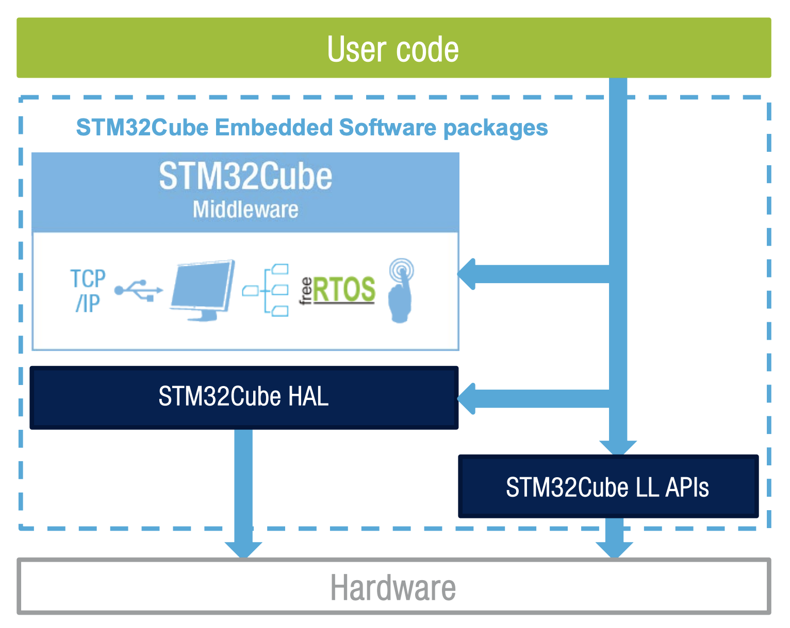

# Hello, World!

</br>

In this second part of the first practice, we will see how to achieve exactly the same functionality as in the first part with the same microcontroller, but by programming at the register level. Programming at the register level means delving into the core of the microcontroller and programming it *manually*. Arduino does this for us behind the scenes, without us realizing it, making it easier to carry out small projects or prototypes.

But... Then... Why not use Arduino if it makes my life easier? Good question, my dear Watson. Before looking at the reasons, let's consider the main consequence: **Arduino has little to no presence in the industrial/professional field**. There are several reasons why Arduino is not widely used in the industry or professional field, but three stand out: 1) [Arduino is licensed under LGPL](https://github.com/arduino/Arduino/blob/master/license.txt), 2) it does not optimize the resources of our microcontroller, and 3) it does not comply with the regulations required by the applicable medical device regulation.

The first reason results in the obligation to provide the `.o` files ([*object* files](https://github.com/arduino/Arduino/wiki/Build-Process)) generated by Arduino during the compilation process under the same license. This means that the *object* file must be made publicly available, and reverse engineering can be performed on these files to reconstruct the code or generate an image of it... In the industrial/professional field, this creates an insurmountable barrier: **you cannot protect your development**. Additionally, related to the second reason, if you modify Arduino to adapt it to your product (for example, to improve the efficiency of microcontroller resource usage), you must openly release the source code. This leads us to the second reason.

Arduino works on a vast number of available microcontrollers. The consequence: **it is not optimized for any particular one**. When working with microcontrollers, **available resources** are **limited**, and optimizing them is crucial. Programming at the register level allows us to achieve that optimization by enabling us to configure even the smallest details of our microcontroller.

Now comes the "But then... why did you make me do the previous practice in Arduino!?" Well, let me refer you to the first paragraph: **Arduino is a very powerful tool for prototyping**. It allows us to **create a prototype with minimal effort and time**, which can later be migrated from Arduino code to register-level code for a commercial version. The time savings that Arduino offers during prototyping is a valuable asset that directly impacts cost and *time-to-market*. This is one of the many development flows used in the professional field and the one we follow in these practices: **first, we create a prototype in Arduino to ensure the desired functionality is achieved, and then we migrate the code to register-level programming and apply the necessary optimizations**.

In this case, we will see how to work with digital inputs/outputs at the register level using STM32CubeIDE. To do this, we will use the **[HAL (*Hardware Abstraction Layer*)](https://en.wikipedia.org/wiki/Hardware_abstraction_layer)** libraries provided by STMicroelectronics. The HAL libraries offer an interface between our *software* and the microcontroller's *hardware*. They allow us to achieve a **higher level of abstraction** in our code (high abstraction means that the code is not tightly bound to the specific *hardware* and can therefore be more easily migrated to another microcontroller) and provide tools that **simplify development**. Nevertheless, these libraries also allow us, when needed, to directly access the core of the microcontroller to **optimize our application**.

<p align="center">
<a href="../assets/imgs/hal-overview.png">

</a>
</p>

> Image from [STMicroelectronics](https://www.st.com/content/ccc/resource/sales_and_marketing/presentation/product_presentation/37/55/ff/bc/a8/71/4f/c5/stm32_embedded_software_offering.pdf/files/stm32_embedded_software_offering.pdf/jcr:content/translations/en.stm32_embedded_software_offering.pdf). 

**Not all companies offer HAL libraries**. Whether they provide them or not **is another criterion** to consider when **choosing** to develop our product with a microcontroller from one company or another, as it directly impacts development time (*time-to-market*) and, consequently, its cost. For this reason, **leading development companies usually offer HAL**. Each company's HAL is different, so as developers, we will need to learn the HAL of the relevant microcontroller. However, once we have learned to use one HAL, switching to another company's HAL won't require much effort, as they usually follow a similar implementation philosophy.

> If we don't want to use HALs, we can always go full hardcore and write code at the lowest level (and thus become the typical person on Internet forums loudly proclaiming that they don't use HAL...), but this is not the most common approach for **most** developments. However, there are specific cases that require extreme resource optimization, making it necessary to implement our own HAL. But again, these are **very specific cases**.

Now, let's turn on that LED!

## Objectives

- Understand STM32CubeIDE and how it works.
- Generate code using the STM32CubeMX tool.
- Learn the basic structure of `main.c` and its proper usage.
- Use GPIOs for both input and output.
- Create, compile, and upload the first C/C++ program at the register level.
- Learn new C and Git functionalities and commands.

## Procedure

### Create a development branch

Let's start by ensuring we are on the `main` branch and that it is up to date with the latest changes from the remote repository. To switch to the `main` branch, we run the following command:


```bash
git switch main
```

We check that the terminal indicates we are on the `main` branch. If we are unable to switch, it is likely due to having uncommitted changes. In that case, we make the necessary commit and then switch branches.

Once we are on the `main` branch, to import any changes made in the remote repository, we execute the following command:

```bash
git pull
```

This command performs the inverse operation of the `git push` command. While `git push` uploads changes to the remote repository, the `git pull` command imports them. The terminal will indicate whether there are any new changes that have been incorporated into our local repository.

With everything properly synchronized, let's create our development branch for this practice:

```bash
git switch -c lab/B-<full-name-without-spaces-nither-strange-characters>
```

We ensure that we have successfully switched branches and can now begin development.

### IDE Preparation

#### Installing STM32CubeIDE

First, we need to **install STMicroelectronics' IDE: STM32CubeIDE**. You can find it at this [link](https://www.st.com/en/development-tools/stm32cubeide.html). It will ask for an email address, to which a link will be sent to start the installer download. Once downloaded, we launch it and click `Next`, `Next`, `Next` until the installation is complete. **Make sure to allow the installation of any requested drivers**. These drivers enable us to upload programs to the microcontroller and, in the future, communicate with it via a serial connection.

#### Creating a Project

Once STM32CubeIDE is installed, we launch it. A window will appear asking us to select a folder that will serve as the workspace for our application. This workspace will contain various files related to the IDE configuration and available projects. **We choose the `stm32cube` folder within our local repository as our workspace directory**.


<p align="center">
<a href="../assets/imgs/workspace-selection.png">

</a>
</p>

> The files generated in the *workspace* that are not part of the project itself are usually auxiliary files that do not need to be stored under version control. For this reason, these files are added to the `.gitignore` file inside the `stm32cube` folder. I encourage you to take a look at it to see which files are excluded from version control and how this is specified. You can open the `.gitignore` file with Notepad.

Once the *workspace* is selected, go to `File > New > STM32 Project`. A window will open where we can choose the microcontroller for which we are going to develop the application. Although we could manually select the [STM32F401RET6U](https://www.st.com/en/product/STM32F401RE) microcontroller and start development from there, the tool allows us to choose our EVB from the `Board Selector` tab. This way, the tool pre-configures the project with the available resources on the EVB (LED, button, UART communication, etc.). 

Our EVB is the `NUCLEO-F401RE`. We can use the search function to find our EVB more easily. Once found, we select it from the list and click `Next`.


<p align="center">
<a href="../assets/imgs/target-selection.png">

</a>
</p>

A second window will prompt us to enter the project name. We will name it `masb-p01`. It also allows us to select a different location to store the project if we wish. By default, it will be saved in a folder within the *workspace* we specified when launching the application, using the same name as the project we entered. 

**We leave the default location** and click `Finish`.

<p align="center">
<a href="../assets/imgs/project-setup.png">

</a>
</p>

A message will appear asking whether we want to initialize the microcontroller peripherals to their default mode. We will say yes (this is always the recommended option).

Next, we are informed that the project is associated with STM32CubeMX, the STM tool that allows us to configure HAL graphically, and we are asked if we want to open this tool. Of course, we say yes. No doubt about it.

> Check the option to remember this selection if you don’t want to be asked again for future projects.

### Hey, hello again, World

#### Configuring the LED-connected pin

At this point, the project and all its basic files have been created. The first thing that has opened is the graphical configuration tool for the microcontroller: STM32CubeMX. This window/tool is associated with the `.ioc` file, which can be found within the project.

> If it is not already expanded, you can expand the project by clicking on the arrow next to it in the `Project Explorer` window on the left.

<p align="center">
<a href="../assets/imgs/stm32cube.png">

</a>
</p>

In the STM32CubeMX window, an interactive image of the microcontroller and all its pins appears. Through this interactive image, we can configure the function of each pin individually (something we couldn't do with Vanilla Arduino).

> ["Vanilla"](https://en.wikipedia.org/wiki/Vanilla_software) is a term used to refer to using an element without modifications. "Arduino Vanilla" means "Arduino just as it comes out of the box."

Let's configure the pin connected to the LED. By default, it is already configured since we selected the correct EVB when creating the project, but we will do it anyway to see how it's done.

To select the function we want for a pin, we left-click on the pin in question and choose the desired function from the available options. In this case, we left-click on pin `PA5` and select `GPIO_Output`. Since it was already configured, what we just did is reset it. Click again on the pin and select the `GPIO_Output` function.

Next, we will assign an alias or *label* to the pin so that when programming, the **code is much more readable**. We do this by right-clicking on pin `PA5` and selecting `Enter User Label`. In the pop-up text box, we type `LED`.

If we click on `System view`, located just above the interactive image, we enter a view showing the different currently configured peripherals. Among the various peripherals pre-configured by STM32CubeMX, we find the `GPIO` peripheral. Clicking on it takes us to a detailed view of the GPIO configuration. Here, two pins are configured—one of them is the LED we just set up, and the other is the push button pre-configured by the tool. If we select the row for the LED pin, a form appears below where we can configure different aspects of the pin: default output, output type, pull-up/down settings, pin speed, and its alias. In this case, you don’t need to modify anything beyond choosing the default output level for the LED. **By default**, unless you want the opposite, **the output will be low, and the LED will be off**.

Now we have the microcontroller correctly configured. Click `File > Save`, and you will be asked whether to generate the code from this configuration. Click `Yes`.

> If for any reason, you are not prompted to generate the code when saving, you can always do so by clicking `Project > Generate code` or clicking the  icon.

#### The *main* file

When the code is generated, STM32CubeMX creates different files in the project and modifies the `main.c` file of our application. **This file contains the `main` function, which will be executed by the microcontroller**. Using the `Project Explorer`, open the `main.c` file located within the project at `Core > Src > main.c`. Scroll quickly from top to bottom. Everything in this file—and many more lines of code spread across different files—has been generated for us by STM32CubeMX. Thank you, STM32CubeMX! 🙏 Long live HAL! 🥳 Let's take a look at the structure of the `main.c` file.

When using HAL, **comments play a fundamental role** since they indicate where we can and cannot write our code. If we do it in the wrong place, when regenerating the code with STM32CubeMX (due to configuration changes), our code will be deleted if it’s in an incorrect location. So, be careful!

Where can we add code? **We can write code between comments that start with `USER CODE BEGIN` and `USER CODE END`**. For example, the following lines correspond to the first lines of `main.c` up to line 32 (**do not add any of this to your `main.c` file**).


```c
/* USER CODE BEGIN Header */
--> WE CAN ADD CODE HERE
/**
  ******************************************************************************
  * @file           : main.c
  * @brief          : Main program body
  ******************************************************************************
  * @attention
  *
  * <h2><center>&copy; Copyright (c) 2020 STMicroelectronics.
  * All rights reserved.</center></h2>
  *
  * This software component is licensed by ST under BSD 3-Clause license,
  * the "License"; You may not use this file except in compliance with the
  * License. You may obtain a copy of the License at:
  *                        opensource.org/licenses/BSD-3-Clause
  *
  ******************************************************************************
  */
/* USER CODE END Header */

/* Includes ------------------------------------------------------------------*/
#include "main.h"
--> ¡¡HERE WE CANNOT ADD CODE!!

/* Private includes ----------------------------------------------------------*/
/* USER CODE BEGIN Includes */
--> WE CAN ADD CODE HERE
/* USER CODE END Includes */

/* Private typedef -----------------------------------------------------------*/
/* USER CODE BEGIN PTD */
--> WE CAN ADD CODE HERE
/* USER CODE END PTD */
  
...
```

Now that we know about the comments and that we cannot add code wherever we want, let's move on to see what the `main.c` file contains, ignoring/eliminating everything that is commented.

The first instruction is:

 ```c
...
  
/* Includes ------------------------------------------------------------------*/
#include "main.h"
  
...
 ```

This instruction, and **all those starting with a hash `#`**, is not executed by the microcontroller, but rather **it is an instruction for the [preprocessor](https://en.wikipedia.org/wiki/Preprocessor)**. The `include` instruction tells the preprocessor to, as its name suggests, include the specified file before performing the program's [compilation](https://en.wikipedia.org/wiki/Compileriki/Compilador). In this case, the included file is `main.h`, a file with a `.h` extension called a [`header`](https://www.tutorialspoint.com/cprogramming/c_header_files.htm). This type of file, which we don’t use in Arduino (because it's hidden from us, not because it doesn't exist), contains the definition of constants, macros, global variables, function prototypes, etc. At the moment, we don’t know what all these elements are. Little by little, we'll see them. To view the content of this `main.h`, we can open it from the `Project Explorer` under `Core > Inc > main.h`. If we don't know the file's location (which is quite common!), we can place the cursor over the file name in the `#include` instruction and press `F3`. This will directly open the `main.h` file.

> **The `F3` shortcut is super useful!** When you're not sure where a file, function, or variable comes from, place the cursor over it and press `F3` to show its origin.

The following code is:


```c
...

/* Private variables ---------------------------------------------------------*/
UART_HandleTypeDef huart2;

...
```

This instruction declares a global variable named `huart2`. Being global, this variable can be used from any function within the file where it has been declared. Remember, a variable is global when it is not declared inside any function.

It is of type `UART_HandleTypeDef`, a non-standard variable type defined using the keyword [`typedef`](https://en.wikipedia.org/wiki/Typedef). The `typedef` keyword is used to assign an alternate name to an existing variable type to make the code more readable.

Next, in `main.c`, we find:


```c
...

/* Private function prototypes -----------------------------------------------*/
void SystemClock_Config(void);
static void MX_GPIO_Init(void);
static void MX_USART2_UART_Init(void);

...
```

In this section of the code, the [prototypes](https://www.tutorialspoint.com/importance-of-function-prototype-in-c) of three different functions are specified. In Arduino, we don't do this because it is handled automatically. Prototyping a function serves to inform the compiler about which functions exist, what type of value they return (if any), and what type of parameters they take (if any). These three functions are used within the `main` function, and their code appears after this.

Right after the prototypes, the `main` function appears, the function that the microcontroller will execute.

```c
...
  
/**
  * @brief  The application entry point.
  * @retval int
  */
int main(void)
{
  HAL_Init();
  SystemClock_Config();
  MX_GPIO_Init();
  MX_USART2_UART_Init();

  while (1)
  {
   
  }

}

...
```

The `main` function is implemented in such a way that **its content is highly readable** (which is always what we aim for when developing our code!). Without knowing the exact details of what it does, just by the function names, we can see that in the `main` function, first, the HAL libraries are initialized. Then, the system clock is configured. Next, the GPIO peripheral is initialized. After that, the UART communication peripheral is initialized, and finally, the program enters the *while loop*. The first four instructions will only be executed **once at the start of the program (equivalent to the `setup` function in Arduino)**. **What is inside the *while loop* will be executed continuously (equivalent to the `loop` function in Arduino)**.

Finally, there are a series of functions generated by STM32CubeMX, whose details we won't go into for now. Basically, they perform the tasks mentioned above: initializing the clock system, GPIO, and UART.

```C
...

/**
  * @brief System Clock Configuration
  * @retval None
  */
void SystemClock_Config(void)
{

...
  
}

/**
  * @brief USART2 Initialization Function
  * @param None
  * @retval None
  */
static void MX_USART2_UART_Init(void)
{

...
  
}

/**
  * @brief GPIO Initialization Function
  * @param None
  * @retval None
  */
static void MX_GPIO_Init(void)
{

...
  
}

/**
  * @brief  This function is executed in case of error occurrence.
  * @retval None
  */
void Error_Handler(void)
{

}

#ifdef  USE_FULL_ASSERT
/**
  * @brief  Reports the name of the source file and the source line number
  *         where the assert_param error has occurred.
  * @param  file: pointer to the source file name
  * @param  line: assert_param error line source number
  * @retval None
  */
void assert_failed(uint8_t *file, uint32_t line)
{ 
 
}
#endif /* USE_FULL_ASSERT */
```

#### "Oh my God... I just want to make the LED blink!"

Okay, okay. Let's do it. To make the LED blink, we only need to add the instruction to turn it on and off. There's no need to configure/initialize anything as STM32CubeMX has already done that for us.

Since this is something we want to run continuously, we will add it inside the *while loop*. Where exactly? Where I indicate in the following code (**do not add this to your `main.c`**):

```c
...
  
  /* Infinite loop */
  /* USER CODE BEGIN WHILE */
  while (1)
  {
    YOU CAN PUT CODE HERE
    /* USER CODE END WHILE */

    DONT EVEN THINK ABOUT PUTTING ANYTHING HERE!
      
    /* USER CODE BEGIN 3 */
    YOU CAN PUT CODE HERE
  }
  /* USER CODE END 3 */

...
```

Clearer than water. **If you put code where it doesn't belong, STM32CubeMX will delete it when regenerating the code.**

And what functions are there to make the output of the pin connected to the LED `PA5` be `0` or `1`? Here, the documentation provided by the owner of the HAL is of utmost importance. STMicroelectronics provides a user guide with all the available instructions in the HAL. You can find this document [here](https://www.st.com/content/ccc/resource/technical/document/user_manual/2f/71/ba/b8/75/54/47/cf/DM00105879.pdf/files/DM00105879.pdf/jcr:content/translations/en.DM00105879.pdf). **Keep this document like gold and always have it at hand!**

In the documentation, among a large number of functions, we find the following function within the GPIOs: `HAL_GPIO_WritePin`. This is the instruction we need to use to set the output value of a GPIO pin.

> **It is extremely important that you know how to navigate the documentation**. For that reason, I recommend looking up all the functions we use in the [HAL user guide](https://www.st.com/content/ccc/resource/technical/document/user_manual/2f/71/ba/b8/75/54/47/cf/DM00105879.pdf/files/DM00105879.pdf/jcr:content/translations/en.DM00105879.pdf). There, you'll find their purpose and usage.

So, let's make the LED turn off and on by adding the `HAL_GPIO_WritePin` function inside the *while loop*.

```c
...
    
  /* Infinite loop */
  /* USER CODE BEGIN WHILE */
  while (1)
  {
	  HAL_GPIO_WritePin(LED_GPIO_Port, LED_Pin, GPIO_PIN_SET); // turn on LED
	  HAL_GPIO_WritePin(LED_GPIO_Port, LED_Pin, GPIO_PIN_RESET); // turn off LED
    /* USER CODE END WHILE */

    /* USER CODE BEGIN 3 */
  }
  /* USER CODE END 3 */

...
```

> A very useful *tip*, **extremely useful**, is the shortcut `CTRL`+`SPACE`. If while typing the function you press that shortcut, a list will appear where you can find all the available functions, variables, and macros. As you type, the list will filter the results until you can find the element you're looking for. The same works for variables and macros.

The function `HAL_GPIO_WritePin` requires three parameters: the port of the pin, the pin number, and the desired output state. The LED pin is `PA5`, which corresponds to port `A` (`GPIOA`) and pin 5 (`GPIO_PIN_5`). And we want it to be high (`GPIO_PIN_SET`) and low (`GPIO_PIN_RESET`). All this information can be found in the [HAL document](http://bit.ly/2UvNqwb).

Since we have labeled the LED pin in STM32CubeMX, we can use the macros `LED_GPIO_Port` and `LED_Pin`, making the code more readable.

> "You've mentioned macros several times. What is that?" A macro is generated from a preprocessor instruction (remember, instructions that start with the hash `#`). This instruction is `#define`. With this instruction, we tell the preprocessor to replace a given macro with specific code before compiling. For example, the macro `LED_Pin` is defined:
>
> ```c
> #define LED_Pin				GPIO_PIN_5
> ```
>
> So every time we use `LED_Pin`, it will be replaced by `GPIO_PIN_5` before compiling the program. In turn, `GPIO_PIN_5` is another macro:
>
> ```c
> #define GPIO_PIN_5    ((uint16_t)0x0020)  /* Pin 5 selected    */
> ```
>
> The `F3` shortcut also applies to macros, so you can always see the definition of a macro.
>
> Macros are very useful for making the code more readable and for quickly modifying a program in response to a design change. For example, if we use the `LED_Pin` macro throughout the code and the LED moves from pin `5` to pin `2`, we can change the definition of the `LED_Pin` macro:
>
> ```c
> #define LED_Pin				GPIO_PIN_2
> ```
>
> and all our code is automatically updated. If we had used `GPIO_PIN_5` directly, we would have to go through the code one by one and replace each `GPIO_PIN_5` with `GPIO_PIN_2`.
>
> Lastly, it is usually an unwritten rule to write macros in all uppercase letters to make them easily identifiable.

Perfect, let's compile the project. We can do this from `Project > Build project` or by clicking on the hammer icon . If there are no errors, in the console located at the bottom, we will see the message:

<p align="center">
<a href="../assets/imgs/no-error-console.png">

</a>
</p>

If that's the case, let's load the program onto the microcontroller. To do this, we make sure the EVB is connected to the computer and go to `Run > Debug` or press the bug icon . The first time we debug a project, the following window will appear:

<p align="center">
<a href="../assets/imgs/select-debug-config.png">

</a>
</p>

We select `STM32 Cortex-M C/C++ Application` and click `Ok`. In the next window that appears, we click `Ok` again. We won't need to do this anymore in this project.

When we start debugging a program, we will be asked to change the IDE perspective. We click `Switch`, having previously checked the box that allows us to remember this choice. The perspective will change, and the cursor will be placed on the first instruction within the `main` function.

<p align="center">
<a href="../assets/imgs/debuger-view.png">

</a>
</p>

**The execution of our program is paused just before the highlighted instruction is executed**. To start the execution, we click `Run > Resume` or click on the icon .

As we saw in the first part of the practice in Arduino, the LED does not blink. The *delays* are missing. We stop the program's debugging by clicking `Run > Terminate` or clicking on the icon , and then we go to add the *delays*.

**In the HAL documentation, we search for how to implement a *delay***. We will find that our function is `HAL_Delay()`, where the time is given in milliseconds. Let's add the instruction to the code.

```c
...
  
  /* Infinite loop */
  /* USER CODE BEGIN WHILE */
  while (1)
  {
	  HAL_GPIO_WritePin(LED_GPIO_Port, LED_Pin, GPIO_PIN_SET); // turn on LED
	  HAL_Delay(1000); // delay 1 second
	  HAL_GPIO_WritePin(LED_GPIO_Port, LED_Pin, GPIO_PIN_RESET); // turn off LED
	  HAL_Delay(1000); // delay 1 second
    /* USER CODE END WHILE */

    /* USER CODE BEGIN 3 */
  }
  /* USER CODE END 3 */

...
```

We test the program, and this time, the LED blinks every 1 second. We stop the debugging and go to save this version of the code.

Since many new files were created when we made a new project, adding each file one by one would be tedious. Therefore, we will use the Git instruction to add files to the *stage* as we already know, but instead of specifying the names of the files, we will make it add all the new, edited, or deleted files:

```bash
git add -A
```

"Wow... You should have taught me that from the start...". No. In this case, it is appropriate to add all the files at once because we initialized a new project and many files were created in a single action, but the recommended practice is to make *commits* where only a few files are modified and add them manually to the *stage* as we have done so far.

We make the *commit*, and if we want, a *push* to upload the changes to the remote repository.

```bash
git commit -m "LED blinking every 1 second"
git push
```

Remember that, since we created a new branch, the `push` command will give us an error and indicate the command we should use. **Copy that command and execute it**. Once the new branch has been uploaded to the remote repository, we can execute the `push` command normally.

### Digital Inputs

Now, let's try to turn the LED on and off using the B1 button. To do this, we need to configure pin `PC13`. Open STM32CubeMX by double-clicking the `.ioc` file in our project. In the interactive image, configure pin `PC13` as `GPIO_Input` and label it as `PUSH_BUTTON`. Once done, regenerate the code .

Go back to the `main.c` file, and if we've added our code in the right place, it will still be there. Not there? You'll need to add the code again.

> In reality, **Git would be the tool to use** here, as we would always make a *commit* just before any code regeneration. This way, if our code gets deleted, we can go back to the immediately previous version and restore our program. But since we haven't yet seen how to revert to a previous version, if your code gets deleted, you'll have to add it back to `main.c` (and this time in the correct place!).

In `main.c`, it seems nothing has been modified, but actually, there is a modification. For example, the function `MX_GPIO_Init` now initializes pin `PC13` as `PUSH_BUTTON`, which it didn't before.

Now, let's make it so that depending on the state of the button, the LED alternates between on and off. According to the HAL documentation, our function is `HAL_GPIO_ReadPin`, and the code will look as follows.

```c
...
  
  /* Infinite loop */
  /* USER CODE BEGIN WHILE */
  while (1)
  {
	  if (HAL_GPIO_ReadPin(PUSH_BUTTON_GPIO_Port, PUSH_BUTTON_Pin) == GPIO_PIN_RESET) { // if B1 pushed
		if (HAL_GPIO_ReadPin(LED_GPIO_Port, LED_Pin) == GPIO_PIN_RESET) { // if LED off
			HAL_GPIO_WritePin(LED_GPIO_Port, LED_Pin, GPIO_PIN_SET); // turn it on
		} else { // if not
			HAL_GPIO_WritePin(LED_GPIO_Port, LED_Pin, GPIO_PIN_RESET); // turn if off
		}
	  }
    /* USER CODE END WHILE */

    /* USER CODE BEGIN 3 */
  }
  /* USER CODE END 3 */

...
```

We can refactor the code using a function available in the HAL: `HAL_GPIO_TogglePin`.

> [Refactoring](https://en.wikipedia.org/wiki/Refactoring) code means improving it by rewriting the same functionality with the goal of enhancing its efficiency, readability, level of abstraction, etc.

In this way, the code would look like:

```c
...

  /* Infinite loop */
  /* USER CODE BEGIN WHILE */
  while (1)
  {
	  if (HAL_GPIO_ReadPin(PUSH_BUTTON_GPIO_Port, PUSH_BUTTON_Pin) == GPIO_PIN_RESET) { // if B1 pushed
		  HAL_GPIO_TogglePin(LED_GPIO_Port, LED_Pin); // toggle state
	  }
    /* USER CODE END WHILE */

    /* USER CODE BEGIN 3 */
  }
  /* USER CODE END 3 */

...
```

We compile and run the program, and as we could already guess, it doesn't quite work properly because the button is being read as *level triggered*. Let's make it *edge triggered* using a boolean variable.

If we look in the comments of `main.c`, we will see that STM32CubeMX indicates that global variables should be added in the following position:

```c
...
 
/* USER CODE BEGIN PV */

/* USER CODE END PV */

...
```

We can use the search function to find these comments. You can open the search by clicking on `Edit > Find/Replace...` or directly with the shortcut `CTRL`+`F`. There, we add our global boolean variable.

```c
...
 
/* USER CODE BEGIN PV */
bool highToLowTransition = false;
/* USER CODE END PV */

...
```

Before continuing, let's compile the program ...

Boom!💣💥Explosion! The IDE indicates an error. We can see them directly in the `Console` window at the bottom of the IDE, or from the `Problems` window located in the same place. The compiler complains that the `bool` variable type doesn't exist, nor does the `false` keyword. In the first error, it suggests a possible solution, which is to replace `bool` with `_Bool`. In this development environment, `bool` variables don't exist by default, and `_Bool` is used instead. We make the substitution and solve the first error.

> It is **very important to get used to reading the information provided by the compiler in the console**, as it gives us a lot of details about the error to fix it, as well as possible solutions, as in this case.

The second error tells us that `false` does not exist. **The logic in a microcontroller is that a value of 0 will always be `false`, while anything different from 0 will be `true` (the same applies in Arduino)**. Therefore, if `true`/`false` doesn't exist, we can use `0` and `1` (or any value other than 0), or we can create our own macros to make the code

```c
#define TRUE			1
#define FALSE			0
```

The last option is the most suitable. Let's incorporate the macros wherever STM32CubeMX comments suggest.

```c
...
  
/* Private macro -------------------------------------------------------------*/
/* USER CODE BEGIN PM */
#define TRUE			1
#define FALSE			0
/* USER CODE END PM */

...
```

Now, we modify the declaration of the previous variable:

```c
...
 
/* USER CODE BEGIN PV */
_Bool highToLowTransition = FALSE;
/* USER CODE END PV */

...
```

And now, we compile and *no problem my friend* 😎.

> It is a very good practice, **highly recommended**, to compile the code from time to time as we develop in order to detect errors as soon as possible. If we do a long development and then have errors, it will be more difficult to trace where they come from.

Now in the `main` function, we have just developed the code:

```c
...

  /* Infinite loop */
  /* USER CODE BEGIN WHILE */
  while (1)
  {
	  if (HAL_GPIO_ReadPin(PUSH_BUTTON_GPIO_Port, PUSH_BUTTON_Pin) == GPIO_PIN_RESET) { // if B1 pushed
		  if (highToLowTransition == FALSE) {  // if not pushed before
			  highToLowTransition = TRUE;  // save that we have pushed
			  HAL_GPIO_TogglePin(LED_GPIO_Port, LED_Pin); // toggle LED state
		  }
	  } else { // if B1 not pushed
		  highToLowTransition = FALSE;  // reset variable value
	  }
    /* USER CODE END WHILE */

    /* USER CODE BEGIN 3 */
  }
  /* USER CODE END 3 */

...
```

We compile/debug  and now, everything works correctly. We stop the debugging and save this version of the code.

```bash
git add -A
git commit -m "we toggle the LED state with the B1 button"
git push
```

Once again, we use `git add -A` because we've modified many files by regenerating the code with STM32CubeMX. Otherwise, we would have done:

```bash
 git add stm32cube/masb-p01/Core/Src/main.c 
```

**Remember that you can always see which files have been created, modified, or deleted with the `git status` command.**

## Challenge

Can you guess what it is? Yes. The same as with Arduino: make the LED toggle between being off and blinking every 500 ms with the push button B1. Complete the challenge, and once you have it, do the corresponding *commit* and *push*.

## Evaluation

### Deliverables

These are the elements that must be available for the evaluation:

- [ ] **Commits**

In the remote repository on GitHub, your branch must have at least the 3 *commits* made during the practice: LED blinking, LED turning on and off with the push button, and the challenge.

- [ ] **Challenge**

In the last *commit* mentioned above, your code solving the proposed challenge must be included.

### Pull Request

Once all the deliverables are ready, remember to do the appropriate *push* and create a *Pull Request* (PR) from your branch to the master, just like in the previous practice.

> **Important!** When creating the PR, add me as a *reviewer* in the PR. You can do this by clicking the gear icon next to the `Reviewers` section on the right side of the PR. Select me from the list. This will send me a notification asking me to review your practice.
>
> In the future, during the project, you can use this review functionality to ask your teammates to review your code proposal before merging it into a branch.
>
> During PR reviews, you might be asked to change something that could improve your code or practice. If you make additional *commits* after creating the PR to apply those requested changes, you don’t need to create another PR. The PR will update automatically with the latest *commits*.

### Rubric

You can find the evaluation rubric on the CampusVirtual. We recommend you take a look at it so you know exactly what will be evaluated and what is expected.

## Conclusions

With this second part, we have finished the first practice of MASB, where we have learned how to work with GPIOs of a microcontroller at the register level using the HAL.

In Git, we saw how to switch between branches and synchronize the local repository to incorporate modifications made in the remote repository. We also learned how to add several files at once to the *stage*.

We learned how to create a project in STM32CubeIDE and how to configure it graphically with STM32CubeMX. We also took a look at the structure of the `main.c` file in the project and where to insert our code.

Finally, we learned other aspects of C programming, such as using macros or `typedef`.